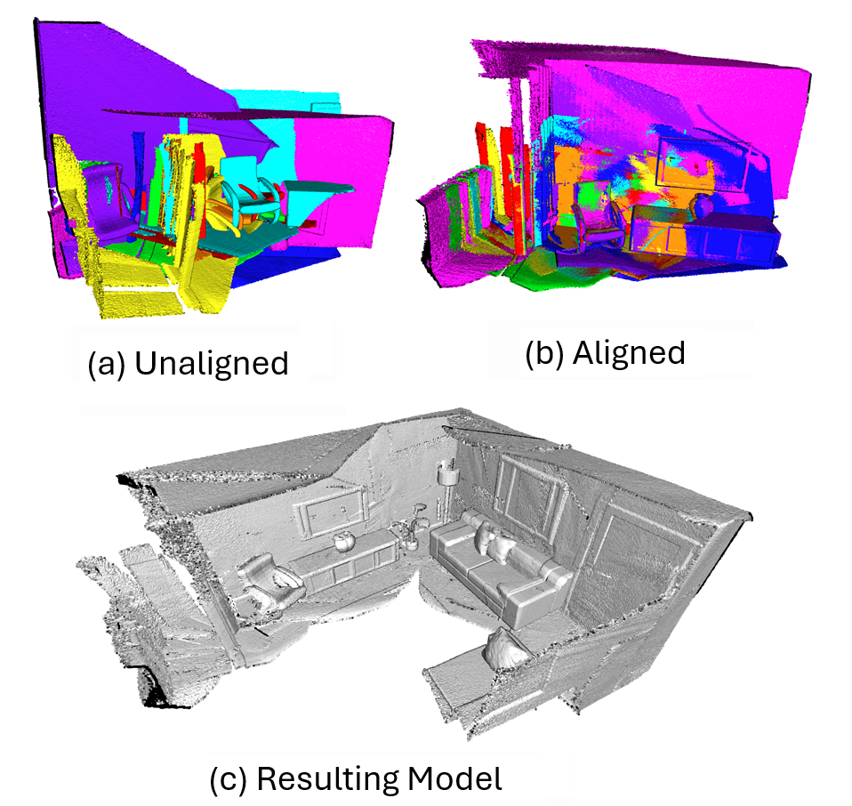

# Point Cloud Fusion System

This project addresses the challenge of accurately reconstructing 3D models of environments from multiple point cloud datasets captured from different viewpoints without requiring prior sensor calibration information.

## Description

The developed system combines advanced global and local registration techniques to effectively align and fuse point clouds from various sources. It employs methods such as Fast Global Registration (FGR) for initialization, Iterative Closest Point (ICP) for local refinement, and Multiway Registration for global joint optimization. The system is implemented in Python and utilizes specialized libraries for 3D data processing.

### Features

* **Global and Local Registration** : Uses FGR for initialization and ICP for refinement.
* **Multiway Registration** : Global joint optimization of multiple point clouds.
* **Result Export** : Exports the resulting 3D model in PLY or PCD formats and its metrics.
* **Interactive Visualization** : Detailed and clear visualization of the resulting model.

## Requirements

* Python 3.6 or higher
* Python Libraries: argparse, matplotlib, numpy, pandas, open3

## Installation

Clone this repository:

```
git clone https://github.com/FlowsyCurls/2024_DISENO_PointCloudFusion.git
cd 2024_DISENO_PointCloudFusion
```

Install the dependencies:

```
pip install -r requirements.txt
```

## Usage

The system is executed from the command line and accepts various arguments to configure its operation.

```
python main.py -i directory_name -t -n 10 -v 0.0425 -m fast -f ply --noview
```

### Arguments

* `-i, --input`: Name of the input directory or identifier of the test dataset.
* `-t, --test`: Indicates if the argument `-i` is an index of a test dataset.
* `-n, --num_point_clouds`: Number of point clouds to consider (default: -1, all).
* `-v, --voxel_size`: Voxel size for downsampling point clouds (default: 0.05).
* `-m, --method`: Coarse registration method to use (`ransac`, `fast`, `icp`; default: `fast`).
* `-f, --format`: Output file format (`ply` or `pcd`; default: `pcd`).
* `--noview`: Disables interactive visualization.

### Example Commands

* Run with a test dataset:

```
python main.py -i 1 -t -n 15 -v 0.0403 -m fast -f pcd
```

* Run with dataset from the `data/stanford-bunny` directory:

```
python main.py -i stanford-bunny -n 3 -v 0.008
```

### Results


## License

This project is licensed under the MIT License.